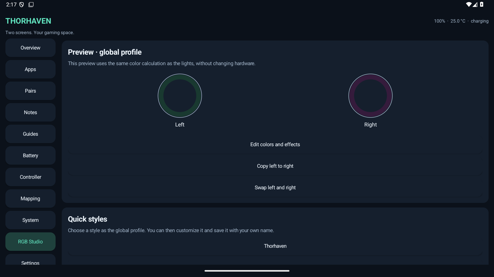

# Thorhaven

**Make the most of both screens on your AYN Thor.**

Thorhaven helps you launch apps on either screen, keep a game guide or your notes below your game, and adjust your controls from one place. Use the features you need and leave the others switched off.

**Android 11 or newer · Dutch and English · Free and open source**

[**Download the APK**](https://github.com/Tufein/Thorhaven/releases/download/v0.7.0-preview/Thorhaven-0.7.0-preview.apk) · [Release notes](https://github.com/Tufein/Thorhaven/releases/tag/v0.7.0-preview) · [User guide](docs/Thorhaven-0.7.0-guide.md)

> Version 0.7 is an early preview. Some features depend on your Thor's firmware and the apps you use. Start with the basic features before enabling advanced controller or hardware settings.

## What can it do?

| Feature | How it helps |
| --- | --- |
| **Apps on both screens** | Choose where an app opens, or launch two apps together as a saved pair. |
| **Guide libraries and maps** | Search your document library, rename or export originals, adjust reading size and edit bookmarks or map markers. |
| **Notes beside your guide** | Keep tips and progress notes next to the guide, then save your edits. |
| **Quick panel** | Reach volume, brightness, favorites and recent apps, and arrange your cards. |
| **Game checklists and profiles** | Track tasks and manually select settings for different games inside one emulator. |
| **Custom shortcuts** | Assign Select + button combinations to apps, guides, saved pairs and other actions. |
| **Controller tools** | Test buttons and sticks, choose presets and adjust button mappings or stick settings. |
| **Controller keyboard** | Type with the controller or touch, insert symbols and move the text cursor. |
| **Battery and play time** | View local screen-off measurements, estimated app time, a session timer and sampled battery graphs. |
| **Backups** | Export a complete ZIP or choose a folder for daily automatic local backups. |
| **Experimental input tools** | Configure touch buttons, short key macros, bounded turbo and an absolute touch/mouse pad with supported root access. |
| **Experimental Screen Lab** | Mirror the main screen below, choose a crop, save screenshots and record short silent MP4 clips. |
| **Media and reports** | Control an active music session, export completed session samples to CSV or save a diagnostic report. |
| **RGB Studio** | Set different colors and effects for each joystick, save your own styles and switch them per app. |
| **Optional hardware profiles** | Apply supported per-app fan/performance settings with session opt-in and recovery. |

Advanced options can also move running apps between screens and adjust supported performance, fan and joystick-light settings. These need extra setup; see **Optional setup** below.

## Install in a few steps

1. [Download the APK](https://github.com/Tufein/Thorhaven/releases/download/v0.7.0-preview/Thorhaven-0.7.0-preview.apk) on your Thor.
2. Open it in Android **Files**. If Android asks, allow that app to install the APK.
3. Open **Thorhaven**. In **Instellen / Settings**, choose **Nederlands** or **English**.
4. In **Settings → Displays**, check which screen is assigned as top and bottom.
5. Open **Apps**, choose an app and launch it on the screen you want.

**Already using Thorhaven?** Install the new APK over the existing version to keep your data. Do not uninstall first. The published 0.1–0.7 APKs use the same signing certificate.

## Try these first

- **Save an app pair:** combine your emulator on top with a music app or browser below, then reopen both with one action.
- **Add a guide:** go to **Guides**, select your game or emulator app and add PDF, text, Markdown or map images.
- **Customize the panel:** select touch-only mode to keep controller focus with your game, and choose which cards to show and their order under Extra tools.
- **Set a shortcut:** open **Settings → Custom shortcuts** and choose what a supported Select + button combination should do.
- **Make a backup:** use **Settings → Complete backup** to include your guides and reading positions. The older JSON backup saves settings only.

Guide imports support PDFs and PNG/JPEG images up to **16 MB**, or UTF-8 text and Markdown up to **2 MB**. Markdown is displayed as text. Complete backups support up to **64 guides** and **128 MB of guide data**.

## Optional setup

Basic app launching, saved pairs, notes and settings do not require root. Enable additional access only for the features you want.

| To use… | Enable… |
| --- | --- |
| The quick panel, guides over games, Select shortcuts and usage measurements | Thorhaven's **accessibility service**, through Settings. |
| The controller keyboard | **Thorhaven Controller Keyboard** in Android's keyboard settings. |
| RGB Studio | Compatible Thor lighting controls; try **Check RGB access**. Direct access can work without root. App-specific RGB switching also uses the accessibility service. |
| Screen Lab mirroring and recording | Android's **screen capture consent** for each session; notifications are optional. |
| System brightness controls | Android permission to **modify system settings**. |
| Moving or swapping running apps | [Shizuku](https://shizuku.rikka.app/download/), then connect it in Thorhaven. |
| Input Lab, advanced controller remapping and supported hardware controls | The supported AYN root service, or **Shizuku running with root access**. |

Shizuku provides additional Android system access. Starting it through wireless debugging can support live app moves, but normally does not provide the root access needed for advanced input or hardware controls. The [user guide](docs/Thorhaven-0.7.0-guide.md) explains the setup and default shortcuts.

**Controller emergency stop:** while advanced remapping is active, hold the original **Select + Start for three seconds** to stop it. You can also stop remapping from the app or quick panel.

## What is new in 0.7?

- **RGB Studio:** independent left/right colors, brightness and effects, with a preview, copy and swap controls.
- **Seven effects and nine quick styles:** solid, breathing, rainbow, color cycle, soft pulse, battery level and charging indicator.
- **Your own styles:** save up to 20 named presets and assign them to up to 64 Android apps. Unassigned apps use your global profile.
- **Session controls:** choose 2, 5 or 10 updates per second with direct access, plus screen-off pause, brightness following, low-battery dimming and an optional stop timer. Root/AYN bridge updates are capped at 2 per second.
- **Stop and recovery:** a foreground notification offers Stop & restore. Interrupted sessions keep a separate recovery record.

Open **RGB Studio**, choose a quick style and select **Check RGB access**. Select **Start RGB** when you want the hardware session to begin. Presets and the on-screen preview work without compatible lighting hardware. The [user guide](docs/Thorhaven-0.7.0-guide.md) explains setup and recovery.

[Read the full change details](docs/Thorhaven-0.7.0-release-notes.md). All features introduced in 0.6 remain available; its [release notes](docs/Thorhaven-0.6.0-release-notes.md) describe Screen Lab, Input Lab and document tools.

See RGB Studio in English

An emulator example of the editor. Physical light colors depend on your Thor.

## A few things to know

- The **black bottom-screen mode** places a black layer over the screen. It does not physically turn the display off. Double-tap or touch with three fingers to restore the picture.
- Moving a running app can cause it to reload, or the app may refuse to move.
- Named game profiles are **selected manually**. Thorhaven does not detect ROM names inside an emulator. Volume and brightness affect the system.
- The virtual controller may appear as another player. If needed, select **Thorhaven Controller** in your emulator.
- Screen-off battery measurements do not prove that the device entered deep sleep. Play-time figures are estimates.
- Input Lab needs compatible **root access**. Macros use sequential keys, not simultaneous combinations. Holds work only when the firmware supports Android's bounded-duration input option; turbo is a finite burst. The pad uses absolute screen coordinates, with an optional mouse source. Game/emulator acceptance varies.
- Automatic backups can be deferred by Android. Hardware automation is experimental, is disabled after restart and needs compatible Thor firmware.
- Screen Lab captures Android's **default/main display**, which may differ from a manually assigned top screen. The preview is limited to 5 frames per second and 960 pixels on its longest side. Recording captures the full main screen, without audio or crop, for up to 3 minutes or 96 MB. Protected content may stay black.
- Screen Lab retains six screenshots and three recordings locally. Export files you want to keep; captures are not included in complete settings backups.
- RGB Studio supports the Thor's two joystick lights when its firmware allows access. The hardware color may differ from the on-screen preview. Stop other RGB controllers and AYN animated lighting before using it.
- RGB Studio restores the actual AYN color, on/off and brightness settings, using current stock settings when they can be read. It cannot resume another app's previous animation. Recovery remains available after an interruption; new sessions wait until recovery succeeds.
- RGB effects do not start automatically after process/device restart or backup import. Screen-color and audio-reactive RGB effects are not included in 0.7.
- Gyro mapping, analog touch sticks, ROM detection and physical display power-off remain unavailable.

The 0.7 release passed **317 automated checks**, including 75 new RGB checks, and a signed update from 0.6 that preserved the app's data. See the [verification report](docs/Thorhaven-0.7.0-test-results.txt) for the results. Physical AYN Thor validation is still needed for LED output, firmware behavior, input acceptance and capture performance. An emulator or simulated lighting backend cannot verify the physical colors or both lighting zones.

## Your data stays local

Thorhaven has **no Internet permission, ads or trackers**. Notes, profiles, guides and measurements stay on your device. Online guide links open in your own browser.

The optional accessibility service uses foreground app names and controller buttons. It does not read screen text or save a keystroke history. Backup files contain your personal notes, guides and usage data, so store them somewhere appropriate. Screen Lab asks Android for capture consent each time and uses a foreground service while sharing. Captures can include visible personal information. RGB effects run in a user-started foreground service; RGB Studio does not capture screen images or audio. Its presets are included in backups, while active sessions and device recovery records are excluded. Diagnostic reports include firmware and display information but omit notes, guide contents, macro contents, tokens and key history; review any file before sharing it.

## Help and feedback

Check the [user guide](docs/Thorhaven-0.7.0-guide.md) for setup and troubleshooting. If something does not work, [open an issue](https://github.com/Tufein/Thorhaven/issues) and include your Thor model, Android/firmware version, Thorhaven version and the steps that caused the problem. Share logs only after checking them for personal information.

## For developers

The full source is available in this repository and with each release. Build instructions, code structure and test setup are in the [developer guide](docs/DEVELOPMENT.md).

## Credits and license

Thorhaven is an independently written project inspired by [Thor-Wayfinder](https://github.com/Thor-Wayfinder/thor-wayfinder) and the AYN Thor community. No Wayfinder source code or artwork is included. The AYN service protocol adaptation credits OdinTools in the third-party notices.

Original application code is released under the [MIT license](LICENSE.txt). Dependency licenses and attributions are listed in [Third-party notices](THIRD_PARTY_NOTICES.txt).
