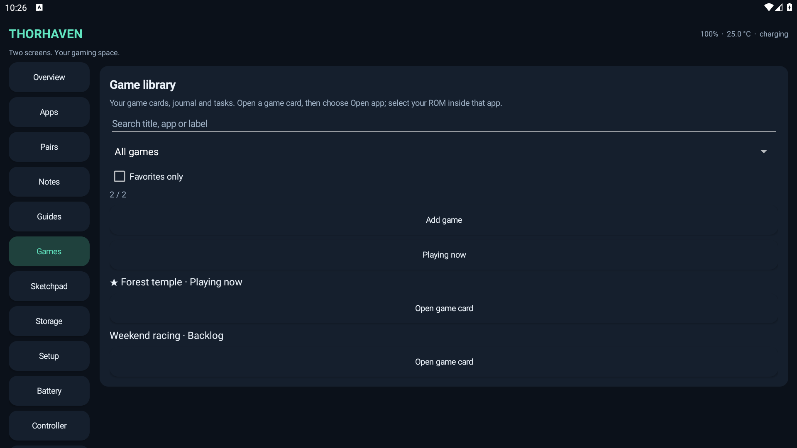
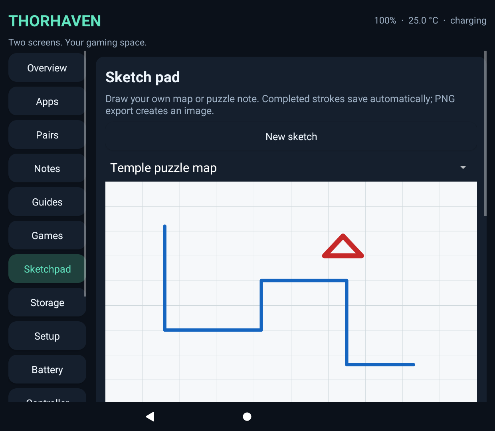

# Thorhaven

**Make the most of both screens on your AYN Thor.**

Thorhaven helps you launch apps on either screen, keep a game guide or your notes below your game, and adjust your controls from one place. Use the features you need and leave the others switched off.

**Android 11 or newer · Dutch and English · Free and open source**

[**Download the APK**](https://github.com/Tufein/Thorhaven/releases/download/v1.0.0-rc1/Thorhaven-1.0.0-rc1.apk) · [Release notes](https://github.com/Tufein/Thorhaven/releases/tag/v1.0.0-rc1) · [User guide](docs/Thorhaven-1.0.0-guide.md)

> **1.0 RC1 is a release candidate for community testing.** The release report records the Android emulator checks and their limits. RGB, privileged input and firmware behavior still need physical Thor feedback before a stable 1.0. Start with the basic features and enable optional tools only as needed.

## What can it do?

| Feature | How it helps |
| --- | --- |
| **Game library** | Keep a Playing now list, searchable labels, favorites and a separate journal/checklist for every game. |
| **Sketchpad** | Draw puzzle notes and maps, use a grid and undo/redo, then export PNG. |
| **Storage and disc tools** | Inspect a selected folder, find its largest files, export CSV and build/check ordered multi-disc M3U playlists. |
| **Setup and launcher shortcuts** | Test each display, choose screen roles, check optional access and pin apps, pairs or guides with a supporting launcher. |
| **Apps on both screens** | Choose where an app opens, or launch two apps together as a saved pair. |
| **Guide libraries and maps** | Search your document library, rename or export originals, adjust reading size and edit bookmarks or map markers. |
| **Notes beside your guide** | Keep tips and progress notes next to the guide, then save your edits. |
| **Quick panel** | Reach volume, brightness, favorites and recent apps, and arrange your cards. |
| **Game checklists and profiles** | Track tasks and manually select settings for different games inside one emulator. |
| **Custom shortcuts** | Assign Select + button combinations to apps, guides, saved pairs and other actions. |
| **Controller tools** | Test buttons and sticks, choose presets and adjust button mappings or stick settings. |
| **Controller keyboard** | Type with the controller or touch, insert symbols and move the text cursor. |
| **Battery and play time** | View local screen-off measurements, estimated app time, a session timer and sampled battery graphs. |
| **Backups** | Export a complete ZIP or choose a folder for daily automatic local backups. |
| **Experimental input tools** | Configure touch buttons, short key macros, bounded turbo and an absolute touch/mouse pad with supported root access. |
| **Experimental Screen Lab** | Mirror the main screen below, choose a crop, save screenshots and record short silent MP4 clips. |
| **Media and reports** | Control an active music session, export completed session samples to CSV or save a diagnostic report. |
| **RGB Studio** | Edit and share your own lighting styles, switch them per app and test individual light zones. |
| **Optional hardware profiles** | Apply supported per-app fan/performance settings with session opt-in and recovery. |

Advanced options can also move running apps between screens and adjust supported performance, fan and joystick-light settings. These need extra setup; see **Optional setup** below.

## Install in a few steps

1. [Download the APK](https://github.com/Tufein/Thorhaven/releases/download/v1.0.0-rc1/Thorhaven-1.0.0-rc1.apk) on your Thor.
2. Open it in Android **Files**. If Android asks, allow that app to install the APK.
3. Open **Thorhaven**. In **Instellen / Settings**, choose **Nederlands** or **English**.
4. Open **Setup**, choose **Check screens and access**, and test which display is Top and Bottom.
5. Open **Apps**, choose an app and launch it on the screen you want.

**Already using Thorhaven?** Install the new APK over the existing version to keep your data. Do not uninstall first. The published APKs through this candidate use the same signing certificate. A signed 0.8 → final RC1 update retained the app identity and seeded data in Android verification; see the release report for exactly what was checked.

## Try these first

- **Organize a game:** open **Games**, add a game card and choose its emulator or Android app. Add journal entries, next steps and collectible tasks. Open the card to see its progress; use **Open app** to launch the selected app and choose your ROM there.
- **Draw a puzzle map:** open **Sketchpad**, create a named page, draw with touch or a stylus, and export a PNG when ready. Completed strokes save locally.
- **Check a ROM folder:** open **Storage**, choose a folder in Android Files and scan. The report covers that folder only; private app data and unknown file sizes are outside its totals.
- **Create a disc playlist:** select disc files from the same folder in the correct order. Preview the M3U, then allow writing to that exact folder to create a new playlist. Existing disc files are not changed. Emulator support varies.
- **Save an app pair:** combine your emulator on top with a music app or browser below, then reopen both with one action.
- **Add a guide:** go to **Guides**, select your game or emulator app and add PDF, text, Markdown or map images.
- **Customize the panel:** select touch-only mode to keep controller focus with your game, and choose which cards to show and their order under Extra tools.
- **Set a shortcut:** open **Settings → Custom shortcuts** and choose what a supported Select + button combination should do.
- **Make a backup:** use **Settings → Complete backup** to include your guides and reading positions. The JSON settings backup also includes game cards and editable sketches, but excludes original guide files and their reading metadata.

Guide imports support PDFs and PNG/JPEG images up to **16 MB**, or UTF-8 text and Markdown up to **2 MB**. Markdown is displayed as text. Complete backups support up to **64 guides**, **128 MB of guide data** and **2 MB of metadata**. The game library has a **300 KB** data limit; the sketch book has a **250 KB** limit. The [guide](docs/Thorhaven-1.0.0-guide.md) explains the individual limits and backup replacement rules.

## Optional setup

Basic app launching, saved pairs, notes, game cards, sketches and storage tools do not require root. Enable additional access only for the features you want.

| To use… | Enable… |
| --- | --- |
| The quick panel, guides over games, Select shortcuts and usage measurements | Thorhaven's **accessibility service**, through Settings. |
| The controller keyboard | **Thorhaven Controller Keyboard** in Android's keyboard settings. |
| RGB Studio | Compatible Thor lighting controls; try **Check RGB access**. Direct access can work without root. App-specific RGB switching also uses the accessibility service. |
| Screen Lab mirroring and recording | Android's **screen capture consent** for each session; notifications are optional. |
| System brightness controls | Android permission to **modify system settings**. |
| Moving or swapping running apps | [Shizuku](https://shizuku.rikka.app/download/), then connect it in Thorhaven. |
| Input Lab, advanced controller remapping and supported hardware controls | The supported AYN root service, or **Shizuku running with root access**. |

Shizuku provides additional Android system access. Starting it through wireless debugging can support live app moves, but normally does not provide the root access needed for advanced input or hardware controls. The [user guide](docs/Thorhaven-1.0.0-guide.md) explains the setup and default shortcuts.

**Controller emergency stop:** while advanced remapping is active, hold the original **Select + Start for three seconds** to stop it. You can also stop remapping from the app or quick panel.

## What is new in the 1.0 candidate?

Game cards, per-game journals and tasks, sketches, selected-folder storage reports, M3U tools, guided display setup and optional launcher shortcuts are all new. Settings and complete backup imports are stricter; settings document I/O and complete restore run away from the UI thread. Unsaved app-note drafts survive activity recreation. Launch failures do not apply volume/brightness profiles, and delayed pair launches cannot outlive their owning dashboard or supersede a newer pair request. **Stop Thorhaven actions** cancels delayed pairs from every Thorhaven window. Display tests close if Android moves them away from the selected display, and closing an RGB test chooser stops its test immediately.

Read the [English change notes](docs/Thorhaven-1.0.0-release-notes.md), [research and primary sources](docs/Thorhaven-1.0.0-research.md), and [physical Thor checklist](docs/Thorhaven-1.0.0-device-checklist.md).

## A look inside

Actual English Android emulator screenshots with example game cards and a puzzle drawing. Games uses a 1920 × 1080 display; Sketchpad uses a 1240 × 1080 display with Android text size set to 130%.

## A few things to know

- The **black bottom-screen mode** places a black layer over the screen. It does not physically turn the display off. Double-tap or touch with three fingers to restore the picture.
- Moving a running app can cause it to reload, or the app may refuse to move.
- Game cards are manual records and do not scan or launch ROMs. Journals, tasks and editable sketches are included in settings/complete backups; ROM files, folder grants, storage reports and captures are not. A restored device must select its folders again.
- M3U checks resolve supported plain filenames in one selected folder. They cannot inspect disc contents, validate CUE track contents or guarantee a frontend's behavior.
- Named game profiles are **selected manually**. Thorhaven does not detect ROM names inside an emulator. Volume and brightness affect the system.
- The virtual controller may appear as another player. If needed, select **Thorhaven Controller** in your emulator.
- Screen-off battery measurements do not prove that the device entered deep sleep. Play-time figures are estimates.
- Input Lab needs compatible **root access**. Macros use sequential keys, not simultaneous combinations. Holds work only when the firmware supports Android's bounded-duration input option; turbo is a finite burst. The pad uses absolute screen coordinates, with an optional mouse source. Game/emulator acceptance varies.
- Automatic backups can be deferred by Android. Hardware automation is experimental, is disabled after restart and needs compatible Thor firmware.
- Screen Lab captures Android's **default/main display**, which may differ from a manually assigned top screen. The preview is limited to 5 frames per second and 960 pixels on its longest side. Recording captures the full main screen, without audio or crop, for up to 3 minutes or 96 MB. Protected content may stay black.
- Screen Lab retains six screenshots and three recordings locally. Export files you want to keep; captures are not included in complete settings backups.
- RGB Studio supports the Thor's two joystick lights when its firmware allows access. The hardware color may differ from the on-screen preview. Stop other RGB controllers and AYN animated lighting before using it.
- RGB Studio restores the actual AYN color, on/off and brightness settings, using current stock settings when they can be read. It cannot resume another app's previous animation. Recovery remains available after an interruption; new sessions wait until recovery succeeds.
- RGB effects do not start automatically after process/device restart or backup import. Normal profiles give both zones of each stick the same style. Zone tests are brief diagnostics, not persistent zone profiles. Screen-color and audio-reactive RGB effects are not included.
- Gyro mapping, analog touch sticks, ROM detection and physical display power-off remain unavailable.

Release verification covers the previous regression suites, new data/lifecycle/SAF/UI checks, real Android capture consent and signed-update compatibility. See the [verification report](docs/Thorhaven-1.0.0-test-results.txt) for actual environments, results and limits. Physical AYN Thor validation is still needed for LED output, firmware behavior, input acceptance and capture performance.

## Your data stays local

Thorhaven has **no Internet permission, ads or trackers**. Notes, game cards, sketches, profiles, imported guides and measurements are stored on your device. Online guide links open in your own browser. Android Files may offer a cloud provider; that provider can sync a folder or export destination you choose. Thorhaven does not upload files itself.

The optional accessibility service uses foreground app names and controller buttons. It does not read screen text or save a keystroke history. Backup files contain your personal notes, guides and usage data, so store them somewhere appropriate. Screen Lab asks Android for capture consent each time and uses a foreground service while sharing. Captures can include visible personal information. RGB effects run in a user-started foreground service; RGB Studio does not capture screen images or audio. Its presets are included in backups, while active sessions and device recovery records are excluded. Diagnostic reports include firmware and display information but omit notes, guide contents, macro contents, tokens and key history; review any file before sharing it.

## Help and feedback

Check the [user guide](docs/Thorhaven-1.0.0-guide.md) for setup and troubleshooting. If something does not work, [open an issue](https://github.com/Tufein/Thorhaven/issues) and include your Thor model, Android/firmware version, Thorhaven version and the steps that caused the problem. Share logs only after checking them for personal information.

## For developers

The full source is available in this repository and with each release. Build instructions, code structure and test setup are in the [developer guide](docs/DEVELOPMENT.md).

## Credits and license

Thorhaven is an independently written project inspired by [Thor-Wayfinder](https://github.com/Thor-Wayfinder/thor-wayfinder) and the AYN Thor community. No Wayfinder source code or artwork is included. The AYN service protocol adaptation credits OdinTools in the third-party notices.

Original application code is released under the [MIT license](LICENSE.txt). Dependency licenses and attributions are listed in [Third-party notices](THIRD_PARTY_NOTICES.txt).
